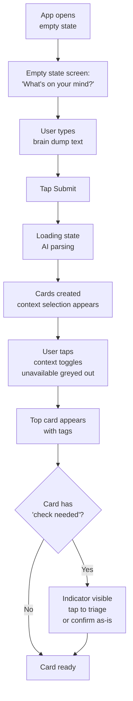
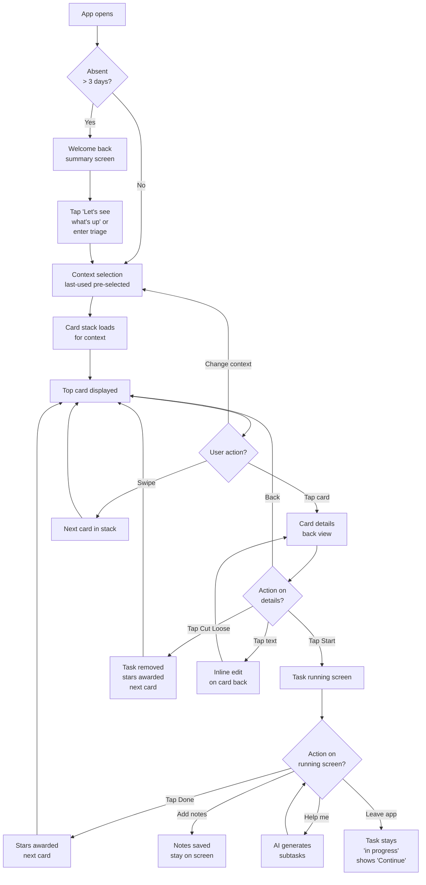
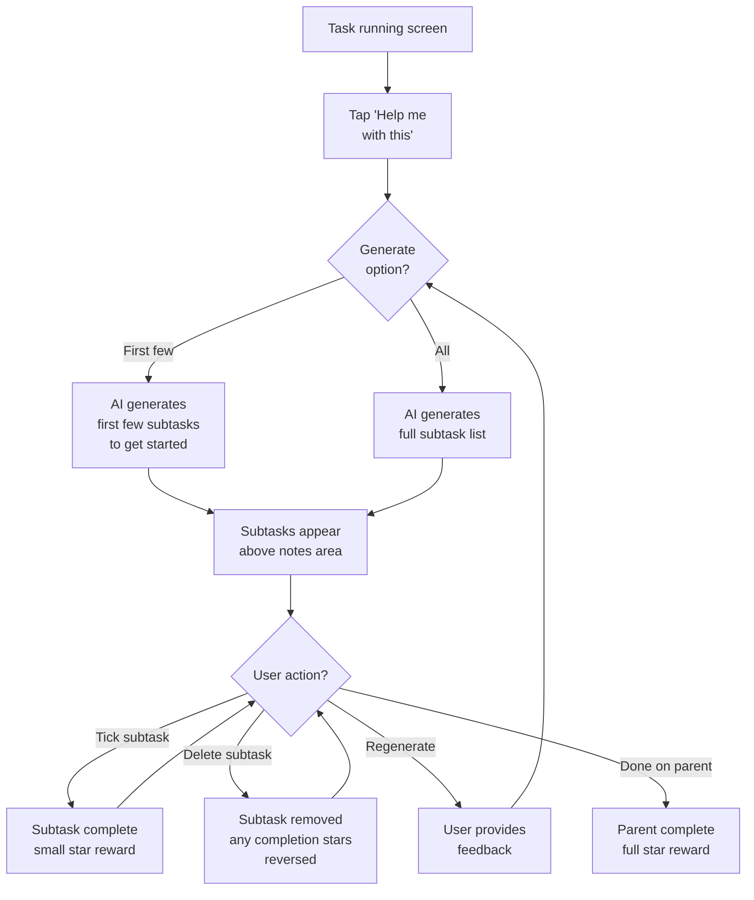
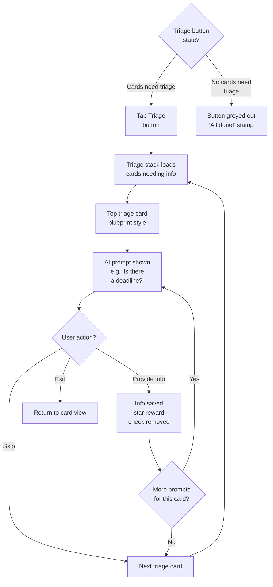
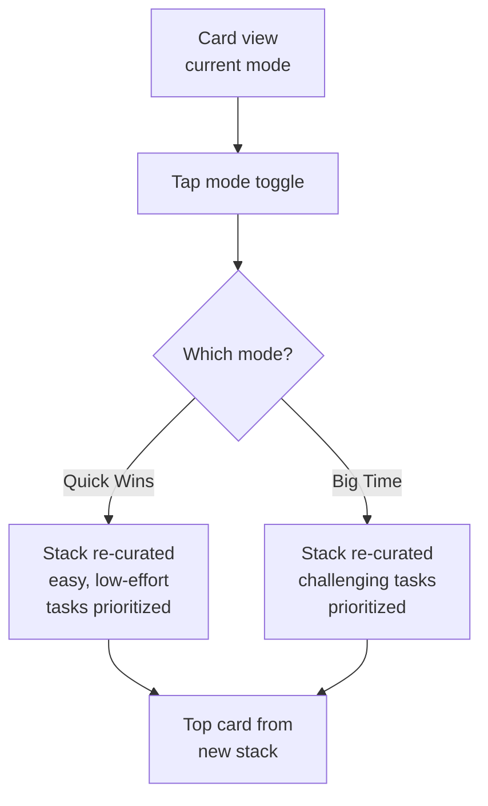
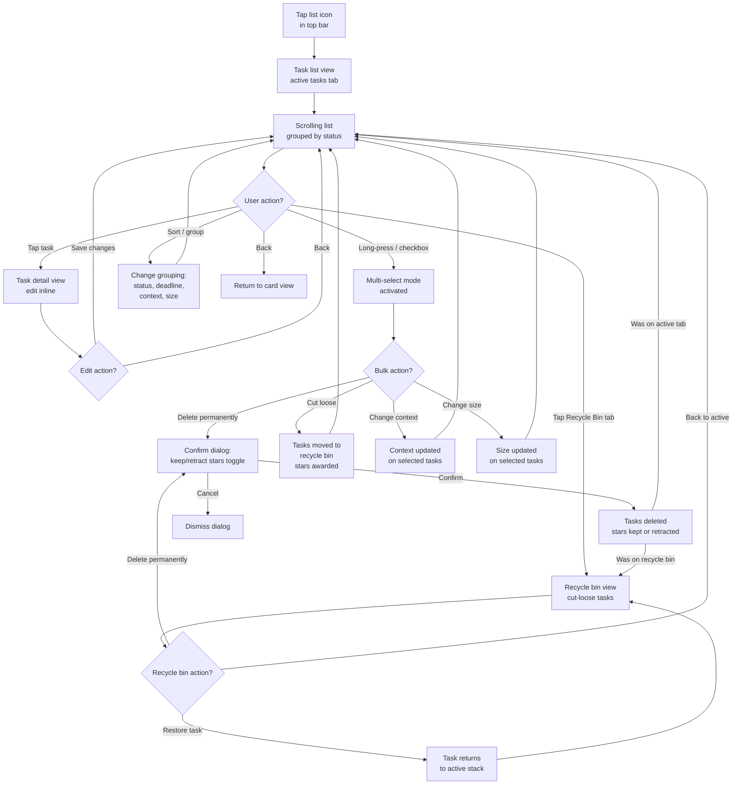

# UX Design Specification — One Down

**Author:** Finn
**Date:** 2026-03-23

---

## Executive Summary

### Project Vision

One Down reimagines task management around a single principle: reduce cognitive load at every step. The app acts as a task caretaker — it does the worrying, organizing, and surfacing so users can focus purely on doing. The core interaction is one card at a time, curated by AI based on context, urgency, and user energy. The philosophy is the moat: no nagging, no guilt, no overwhelm.

### Target Users

**Primary — The Trailing Task Avoider (Alex archetype):**
ADHD or ADHD-adjacent adults who accumulate tasks that create ambient anxiety. They open traditional todo apps, feel dread at the list, and close them. They're actually productive when given one clear, achievable task. They pick up tasks during energy bursts and want the app to match the right task to their current moment.

**Secondary — The Overloaded Professional (Sam archetype):**
Neurotypical but stretched thin. Work is managed in professional tools; personal life tasks slip through. They need a trustworthy, low-maintenance inbox for "life stuff" that handles prioritization without them.

### Key Design Challenges

1. **One-card trust** — Users must trust the app picked the right task without seeing the full list. Curation transparency (context filtering, check indicators) is essential.
2. **Emotional tone consistency** — Every interaction must feel calm, competent, and slightly satisfying. No guilt patterns, no urgency theater, no nagging.
3. **AI transparency** — AI-inferred information (deadlines, task size, context) needs clear "check needed" indicators so users maintain control.
4. **Functional-first aesthetic** — Barebones approach: structural clarity and interaction quality over visual theming. Colors, fonts, and branding deferred to later phase.

### Design Opportunities

1. **Interaction quality as brand** — Once animations are added in a later design pass, card physics can carry premium feel even without visual theming.
2. **Progressive trust building** — Start with simple AI (brain dump parsing), gradually surface smarter features as users build confidence.
3. **Absence recovery as differentiator** — The gentle welcome-back experience is a genuine competitive advantage for the ADHD audience.
4. **Context-first surfacing** — Showing what's actionable *right now* vs. what's abstractly important is a novel approach most competitors don't offer.

## Core User Experience

### Defining Experience

The core loop is deliberately minimal: **Open → Context → Card → Act → Reward → Close**.

1. **Open** — App loads fast (<2s). No badge anxiety, no task counts, no guilt.
2. **Context** — Tap current situation (home/office/laptop/phone/internet). One tap, updates the stack.
3. **Card** — One card appears. The right card. Tagged with size (quick win / big time) and context.
4. **Act** — Tap to see details. Tap Start to begin. Swipe to see alternatives. Or tap Cut Loose.
5. **Reward** — Star count increments. Next card appears.
6. **Close** — Leave whenever. No incomplete session guilt.

The user's only real decision: "Do I want to do this one?" Everything else — prioritization, scheduling, deadline tracking, context matching — is the app's job.

### Platform Strategy

- **React Native Expo** — Cross-platform iOS/Android from a single codebase (~95% shared)
- **Touch-first** — All primary interactions are tap and swipe. No typing required for core loop.
- **Offline-capable** — Core task viewing works offline. AI features degrade gracefully.
- **Performance targets:** <2s cold start, <100ms card interactions.
- **No animations in v1** — All transitions are instant state changes. Animations and theming added in subsequent design passes.
- **Barebones visual approach** — Structural clarity, good spacing, system fonts. No colors/fonts/theming.

### Effortless Interactions

| Interaction | Implementation |
|-------------|----------------|
| Brain dump | Free-text input → AI splits into tasks automatically |
| Context selection | Toggle buttons, tap to select, remembered between sessions |
| Browsing stack | Swipe to change top card |
| Starting a task | Tap card to see details, tap Start to begin |
| Completing a task | Tap Done, star count increments, next card appears |
| Cutting loose | Tap Cut Loose, card removed |
| Coming back after absence | Calm summary screen, quick win surfaced first |

### Critical Success Moments

1. **First brain dump** — User types a messy blob of text, sees it magically become organized cards. "Oh, it *gets* me."
2. **First right card** — After selecting context, the card that appears makes the user think "yeah, I can do that right now." Trust established.
3. **First completion** — The star count goes up, the card is gone, the next one is ready. Clean and satisfying through simplicity.
4. **First return after absence** — No guilt trip. Calm summary. Easy quick win. "This app isn't mad at me."
5. **First cut loose** — User releases a stale task and feels *lighter*, not guilty. The app celebrates liberation.

### Experience Principles

1. **One card, one decision** — Never present a list when a card will do. Every screen should have one clear action.
2. **The app does the worrying** — Prioritization, deadline tracking, staleness detection — all invisible to the user until action is needed.
3. **Calm over urgent** — Default emotional tone is calm competence. Urgency only for genuinely time-critical items, and even then, paired with actionable help.
4. **Reward doing, don't punish not-doing** — Stars for completion, gentle prompts for stale tasks, zero guilt for absence or cutting loose.
5. **Functional before beautiful** — Get all mechanisms working first. Layout and interaction correctness over any visual polish. Animations and theming are separate future design passes.

## Desired Emotional Response

### Primary Emotional Goals

| Moment | Target Feeling | Design Implication |
|--------|---------------|-------------------|
| Opening the app | Calm, no dread | No task counts, no badges, no "you have X overdue" |
| Seeing the card | "I can do that" | Card shows achievable task with clear context match |
| Completing a task | Quiet satisfaction | Star count goes up, next card ready — simple, clean |
| Cutting loose | Liberation, relief | No guilt copy, no "are you sure?" friction |
| Returning after absence | Welcome, not judged | Summary is factual not emotional, quick win surfaced first |
| Encountering a deadline | Controlled urgency | Clear visual indicator when within deadline buffer (e.g. 2 days). Urgency is tangible but actionable — "this needs doing soon" not "you're behind" |

### Emotions to Avoid

- **Guilt** — Never punish absence or incomplete tasks
- **Overwhelm** — Never show full task lists as the default view
- **Decision fatigue** — Never ask "what do you want to do?" without a strong default
- **Anxiety** — Never add urgency that can't be immediately acted on
- **Shame** — Never frame cutting loose or skipping as failure

### Emotional Design Principles

1. **Factual over emotional** — Summaries state facts ("3 tasks hit deadlines") not feelings ("you missed 3 deadlines!")
2. **Agency without burden** — User always has control (edit, skip, cut loose, keep) but never *has* to decide right now
3. **Achievement framing** — Show what's been done (stars earned, tasks completed) not what remains
4. **Gentle nudging** — Stale task prompts offer options (keep/cut/break down), never demand action
5. **Urgency without panic** — Deadline proximity is communicated clearly and visually, but always paired with actionable next steps. The tone is "this needs doing soon" not "you failed to do this"

## UX Pattern Analysis & Inspiration

### Inspiring Products Analysis

**Things 3** — Gold standard for clean task management UX. Minimal visual noise, generous spacing, fast capture. Key takeaway: *less UI = less cognitive load*. Their list view is clean but still a list — One Down's card approach goes further.

**Todoist** — Natural language input ("call mum tomorrow at 3pm") is the benchmark for low-friction capture. Quick-add is genuinely fast. Key takeaway: *brain dump must feel instant*. Their filter system is powerful but complex — One Down replaces manual filtering with context toggles.

**SwipeTask** — Validates the card-stack concept exists in market. Simple swipe-to-complete. Key takeaway: *the concept works, but their implementation is demo-level*. One Down differentiates with AI curation, context awareness, and task caretaker philosophy.

**Tinder/dating apps** — Swipe-card UX is proven for rapid binary decisions. Key takeaway: *one item + simple action = low cognitive load*. The pattern transfers directly to task selection.

### Transferable Patterns

| Pattern | Source | Application in One Down |
|---------|--------|------------------------|
| Quick capture with minimal fields | Todoist, Things 3 | Brain dump input — single text field, AI handles parsing |
| Card-as-primary-UI | SwipeTask, Tinder | Task card is the core interface, not a list |
| Context toggles | Google Maps (transport modes) | Tap to select current context, filters update immediately |
| Pull-to-refresh / add | Many mobile apps | Natural gesture for "I want to add something" |
| Tab bar navigation | iOS conventions | Card view, task overview, brain dump input, settings |
| Empty states with guidance | Stripe, Linear | When no tasks exist, guide user to brain dump |

### Anti-Patterns to Avoid

| Anti-Pattern | Why | Common In |
|--------------|-----|-----------|
| Badge counts on app icon | Creates dread before opening | Most todo apps |
| Sidebar with categories/projects | Adds organizational burden | Todoist, Notion |
| Priority number inputs (P1-P4) | Decision fatigue, abstract | Jira, Todoist |
| Calendar view as default | Shows empty days as guilt | Google Calendar, TickTick |
| "Overdue" in red | Shame, not actionable | Every todo app |
| Tutorial overlays on first open | Delays value, patronizing | Most apps |

### Design Inspiration Strategy

**Adopt:** Single-field brain dump capture, card as primary UI unit, tab bar navigation, generous spacing, empty state guidance.

**Adapt:** Context toggles (simpler than transport mode selectors — just icon buttons). Star rewards (simpler than gamification apps — just a counter that goes up).

**Avoid:** Lists as default view, category/project organization, manual priority assignment, tutorial flows, badge counts.

## Design System Foundation

### Design System Choice

**Approach: gluestack-ui v3 + NativeWind (Tailwind CSS)**

- **gluestack-ui v3** as the component library — provides accessible, composable components out of the box
- **NativeWind / Tailwind CSS** for styling — utility-first, fast iteration, consistent spacing
- **Default theme** — ship with gluestack's defaults, customize later in a dedicated design pass
- **MCP tooling available** — gluestack-ui v3 MCP server (community fork) for component reference during development
- **System fonts throughout** — no custom typography for now

### Rationale

1. **Components out the gate** — Buttons, inputs, modals, cards, toasts — all pre-built and accessible
2. **Tailwind for speed** — Utility classes mean no context-switching to stylesheets. Fast iteration on layout.
3. **Default theme is functional** — Clean, neutral defaults that work immediately. Customization is additive, not required.
4. **React Native Expo compatible** — gluestack-ui v3 is built for the Expo ecosystem
5. **Future-proof** — When theming is added, gluestack's token system makes it a single coordinated pass

### Implementation Approach

- Install gluestack-ui v3 + NativeWind in the Expo project
- Use default theme as-is — no custom tokens initially
- Build screens with gluestack components (Box, Text, Button, Pressable, Card, Input, etc.)
- Customise generic styling with Tailwind utility classes
- Use the gluestack-ui v3 MCP server (https://github.com/DerianAndre/Gluestack-UI-V3-MCP-Server) for component reference — may need bug-fixes as it's a community fork
- Extract app-specific composite components (TaskCard, ContextToggle, etc.) as patterns emerge

### Customization Strategy

Deferred. The first functional build uses gluestack's default theme. A subsequent design pass will:
1. Define the visual identity (colors, typography, iconography)
2. Override gluestack tokens to apply the One Down brand
3. Apply theming in one coordinated pass rather than piecemeal

## Defining Core Experience

### The One-Sentence Experience

**"See one task you can do right now, and do it."**

Users will describe One Down as: "It shows you one thing at a time and handles everything else." The defining interaction is the moment a card appears after context selection — if that card feels right, the app has earned trust.

### User Mental Model

Users bring a **"what should I do?"** mental model. Current solutions force them to answer that question themselves (scan list → decide priority → pick one). One Down inverts this: the app answers the question, the user just says yes or no.

**Mental model shift:** From "I manage my tasks" to "my app manages my tasks, I just do them."

**Potential confusion points:**
- "Where are all my tasks?" → Task overview screen provides full visibility when wanted
- "Why is it showing me this one?" → Context tags and size indicators explain curation logic
- "What if it picked wrong?" → Swipe to see alternatives, the stack always has options

### Success Criteria

| Criteria | Measure |
|----------|---------|
| Card feels right | User starts a task within 3 card views (not browsing endlessly) |
| Brain dump works | User enters text, sees organized cards within 3 seconds |
| Context filtering is useful | User changes context and sees different, relevant cards |
| Completion is satisfying | User taps Done and immediately sees the reward + next card |
| Trust is maintained | User doesn't default to task overview — card view is enough |

### Experience Mechanics

**1. Brain Dump (Capture)**
- User taps "Add" or navigates to brain dump input
- Single text field, placeholder: "What's on your mind?"
- User types freely — multiple tasks in one blob of text
- Tap submit → AI parses text into individual task cards
- Loading state while AI processes (target <3s)
- Cards appear in the stack, each with AI-inferred context tags and size

**2. Context Selection (Filter)**
- Persistent toggle bar on card view screen
- Context options: Home, Out & About, Phone, Laptop, Internet
- Tappable icon buttons — active state is visually distinct
- Remembered between sessions (last-used contexts persist)
- Stack updates immediately when context changes
- If a non-selected context has urgent tasks, show a subtle indicator on that context button

**3. Card View (Core Loop)**
- Top card shows: task title, size tag (quick win / big time), context tags
- "Check needed" indicator (e.g. exclamation mark) if AI-inferred info needs confirmation or the task has missing details
- Deadline indicator visible if within buffer period
- Swipe left/right to browse alternatives in the stack
- Tap card to see details (flip to back / expand)
- Card back shows: full details, notes, deadline info, Start button, Cut Loose button, Edit option
- Star value preview on card (how many stars for completing this)

**3b. Triage / Info Confirmation (On Card)**
- When a card has a "check needed" indicator, tapping it reveals AI prompts
- Prompts ask user to confirm or correct AI-inferred information (deadlines, context, task size)
- Prompts also surface missing info: "Is there a deadline for this?" / "What do you need to do this?"
- Each piece of confirmed or added info earns a small star reward
- Indicator disappears once key info is confirmed

**3c. Triage Mode (Dedicated)**
- Accessible from tab bar or card view (e.g. a "Triage" button when cards need attention)
- Surfaces a dedicated stack of only cards that have incomplete/unconfirmed info
- Blueprint-style aesthetic — visually distinct from the main card stack to signal "organising mode" vs. "doing mode"
- User works through the triage stack: confirm info, add missing details, set deadlines
- Each triaged card earns a small star reward
- Cards drop out of the triage stack once fully filled out
- Optional — users can always triage from the main card view instead. Triage mode is for focused batch processing

**4. Task Running (Execution)**
- Tap Start → screen transitions to task running view
- Shows: task title, subtask list (if any), notes area (editable), Done button, "Help me with this" button (AI breakdown)
- User can add notes while working
- Tap Done → task completes, star count increments, returns to card view with next card
- If user leaves mid-task, card shows "Continue" on return

**4b. AI Task Breakdown ("Help me with this")**
- Tap "Help me with this" → AI generates a few small actionable next steps
- Steps appear as a subtask list above the notes area
- Each subtask has a tickbox — tap to mark done (item fades, reversible). Completing a subtask earns a very small star reward
- Subtasks can be deleted — deleting a completed subtask removes its star addition from the total
- If the AI got it wrong, user can tap to regenerate with feedback ("That's not right — I need to..."). Already completed subtasks are not modified.
- Subtask list and notes are both sent as context when requesting new help
- Subtasks are part of the parent task — completing all subtasks doesn't auto-complete the parent. User still taps Done on the main task when finished

**5. Task Completion (Reward)**
- Tap Done → star counter increments
- Completed task is removed from stack
- Next card appears immediately
- Done box accumulates completed tasks (viewable separately)

**6. Cut Loose (Release)**
- From card back or task running screen, tap Cut Loose
- Task moves to recycle bin — no confirmation dialog, no guilt. Can be restored later from recycle bin in task list view
- Star counter increments (slightly less than completing the task — liberation is still a win)
- Brief acknowledgment ("Released") then next card appears

**7. Task List View (Trust Building)**
- Accessible via list/server icon in the top bar (next to star counter)
- Full scrolling list of all tasks, grouped or sortable by status, deadline, context, size
- Allows bulk actions: multi-select via long-press or checkbox to delete, cut loose, change context, or change size
- This is the "peek behind the curtain" — reassurance that nothing is lost
- Not the default view, not in the tab bar — deliberately a secondary access point

**8. Welcome Back (Absence Return)**
- If user hasn't opened app in >3 days, show a summary screen before card view
- Summary: factual, not emotional. "3 tasks hit deadlines. 12 tasks waiting. 1 suggested to cut loose."
- Options: "Let's see what's up" (goes to card view) or triage mode for quick keep/cut/defer decisions
- First card after absence is always a quick win

**9. Star Reward System (Configuration)**
- All star weights centralized in a single config file (architecture concern)
- Reward triggers: task completion, cut loose, subtask completion, triage confirmation, deadline bonus
- Cut loose reward < task completion reward (but still positive — liberation is valued)
- Subtask and triage rewards are small relative to task completion
- Centralized config allows tuning reward balance without code changes across the app

**10. Star Activity Log**
- Tap the star counter to open the activity log
- Shows a chronological list of star transactions: earned and spent/removed
- Each entry shows: timestamp, action (completed task / cut loose / subtask / triage / subtask deleted), task name, star amount (+/-)
- Simple scrollable list — no filtering needed for MVP

## Visual Design Foundation

**Status: Deferred.** This build uses gluestack-ui v3 default theme with no customization.

### What Ships Now

- **Colors:** gluestack defaults (neutral greys, standard semantic colors for success/warning/error)
- **Typography:** System fonts at default gluestack sizes
- **Spacing:** gluestack/Tailwind default spacing scale
- **Icons:** A standard icon set (Lucide, Heroicons, or similar — decided during implementation)
- **Layout:** Standard mobile patterns — full-width cards, tab bar navigation, generous touch targets

### What a Future Design Pass Adds

- Brand colors and custom palette
- Custom typography (typeface selection, refined scale)
- Refined spacing and component-specific adjustments
- Icon style consistency
- Dark mode
- Motion design and animations

## Design Direction

**Skipped.** Visual design directions deferred to a future design pass. This build ships with gluestack-ui defaults and focuses on layout, interaction flow, and functional correctness.

## User Journey Flows

### Flow 1: First-Time Brain Dump → First Card

### Flow 2: Core Card Loop (Returning User)

### Flow 3: AI Breakdown on Task Running Screen

### Flow 4: Triage Mode

### Flow 5: Quick Wins / Big Time Mode Switch

### Flow 6: Task List View (Full Visibility)

### Journey Patterns

| Pattern | Description |
|---------|-------------|
| **Card → Action → Reward → Next Card** | The universal micro-loop. Every task interaction follows this. |
| **Context gates content** | Context toggles filter what's shown. Changing context = fresh stack. |
| **Star reward on every positive action** | Complete, cut loose, triage, subtask — all reward. Only amounts differ. |
| **No dead ends** | Every screen has a clear next action. Empty states guide to the next useful thing. |
| **Graceful degradation** | AI offline → core task viewing still works. Just no parsing, breakdown, or smart curation. |

## Component Strategy

### gluestack-ui v3 Coverage

Components available out of the box that map directly to One Down's needs:

| Need | gluestack Component | Notes |
|------|---------------------|-------|
| Buttons (Start, Done, Submit, Cut Loose) | `Button` | Various sizes/variants |
| Text input (brain dump, notes, inline edit) | `Textarea`, `Input` | Standard text entry |
| Tab navigation | `Tabs` or custom tab bar | Bottom tab bar pattern |
| Modals / overlays | `Modal`, `Actionsheet` | Confirmation dialogs if needed |
| Toast notifications | `Toast` | Brief acknowledgments ("Released", star awards) |
| Loading states | `Spinner` | AI processing indicators |
| Icons | `Icon` (with Lucide integration) | Context icons, indicators |
| Layout primitives | `Box`, `HStack`, `VStack`, `Center` | All screen layouts |
| Pressable areas | `Pressable` | Tap targets on cards, inline edit |
| Text display | `Text`, `Heading` | All typographic elements |
| Badges / tags | `Badge` | Context tags, size tags on cards |
| Checkboxes | `Checkbox` | Subtask tickboxes |
| Toggle / switch | `Switch` | Quick Wins / Big Time toggle |
| Dividers | `Divider` | Section separation |
| Avatars / indicators | `Avatar`, `Badge` | Star counter display |

### Custom Components Needed

These are One Down-specific composites that don't exist in gluestack — built from gluestack primitives + gesture libraries:

#### TaskCard

**Purpose:** The primary interface unit — a single task displayed as a card.
**Content:** Task title, size tag (quick win / big time), context badges, check-needed indicator, deadline indicator, star value.
**Modes:** Front (summary view), back (full details with Start/Cut Loose/inline edit).
**States:** Default, in-progress (shows "Continue"), has-triage-needed (exclamation indicator).
**Interaction:** Tap to switch between front/back modes. Swipe to browse stack. Back mode has tappable text fields for inline editing.

#### CardStack

**Purpose:** Swipeable deck of TaskCards — the core browsing mechanism.
**Content:** Ordered set of TaskCards, with top card fully visible and 1-2 cards peeking behind.
**States:** Loaded (cards available), empty (no cards for current context — shows guidance), single-card.
**Interaction:** Swipe left/right to cycle cards. Top card is interactive; background cards are decorative hints.
**Implementation note:** Requires `react-native-gesture-handler` + `react-native-reanimated` (v4) for swipe gesture recognition and a simple slide-sideways + fade transition. No fancy physics animation for MVP — just responsive gesture tracking and a clean card transition. Reanimated 4 requires React Native New Architecture (Fabric). Use worklets (`useSharedValue`, `useAnimatedStyle`) for gesture-driven card movement — the new CSS animation API is for state-driven animations only. Babel plugin is `react-native-worklets/plugin` (not the old `react-native-reanimated/plugin`). Always reference https://docs.swmansion.com/react-native-reanimated/ before writing Reanimated code to avoid deprecated v2/v3 patterns.

#### ContextToggleBar

**Purpose:** Row of context filter buttons — selects what's actionable now.
**Content:** Icon buttons for each context (Home, Out & About, Phone, Laptop, Internet).
**States:** Per-button: active (selected), inactive (available), disabled/greyed-out (no cards match this context).
**Interaction:** Tap to toggle. Multiple contexts can be active. Stack updates immediately on change. Last-used selection persists between sessions.

#### ModeToggle

**Purpose:** Switch between Quick Wins and Big Time task curation.
**Content:** Two-option toggle labelled "Quick Wins" / "Big Time".
**States:** One option active at a time. Stack re-curates on switch.
**Interaction:** Tap to switch. Could be a segmented control or simple toggle.

#### TaskRunningScreen

**Purpose:** Expanded view for actively working on a task.
**Content:** Task title, subtask list (if generated), notes area (editable), Done button, "Help me with this" button, Cut Loose button.
**States:** Default (no subtasks), breakdown-active (subtask list visible).
**Interaction:** Tap Done to complete. Tap "Help me" to trigger AI breakdown. Notes auto-save instantaneously to sync local storage.

#### SubtaskList

**Purpose:** AI-generated breakdown steps shown on task running screen.
**Content:** Ordered list of small steps, each with a tickbox and delete button.
**States:** Per-item: pending, completed (faded/struck). Deleted items are simply removed from the list. List-level: empty, populated, regenerating.
**Interaction:** Tick to complete (small star reward). Delete to remove (reverses any completion stars). Regenerate button with feedback input.

#### TriageCard

**Purpose:** Visually distinct card variant for triage mode — signals "organising" not "doing".
**Content:** Task info plus AI-generated prompts (e.g. "Is there a deadline?", "What context do you need?").
**States:** Prompts pending, partially triaged. Once fully triaged, the card ceases to be a TriageCard and returns to the normal stack.
**Interaction:** Answer prompts inline (text input, date picker, toggle). Skip to move to next. Each answer earns small star reward.
**Visual distinction:** Same card structure as TaskCard but with lighter background and dashed border — blueprint aesthetic.

#### StarCounter

**Purpose:** Persistent display of accumulated stars.
**Content:** Star icon + count number.
**States:** Default, incrementing (brief highlight on award), tappable.
**Interaction:** Tap to open StarActivityLog. Increments visibly when stars are awarded.

#### StarActivityLog

**Purpose:** Chronological record of all star transactions.
**Content:** List of entries — each showing timestamp, action type, task name, star amount (+/-).
**States:** Populated, empty (impossible in practice — first action creates first entry).
**Interaction:** Simple scroll. No filtering for MVP.

#### WelcomeBackSummary

**Purpose:** Calm re-entry screen after 3+ days of absence.
**Content:** Factual summary — tasks that hit deadlines, total tasks waiting, suggestions to cut loose. Two action buttons: "Let's see what's up" (→ card view), enter triage mode.
**States:** Single state — shown only when absence threshold is met.
**Interaction:** Tap either action button to proceed.

#### BrainDumpInput

**Purpose:** Free-text entry for capturing thoughts in bulk.
**Content:** Large text area with placeholder ("What's on your mind?"), submit button.
**States:** Empty (placeholder visible), typing, submitting (loading state while AI parses).
**Interaction:** Type freely, tap submit. AI returns parsed cards.

#### EmptyState

**Purpose:** Guidance when no cards exist for current context or globally.
**Content:** Contextual message explaining why it's empty and what to do. E.g. "Nothing here for Home — try another context" or "No tasks yet — brain dump something."
**States:** Per-context empty, globally empty (new user).
**Interaction:** Tap to navigate to relevant action (brain dump, change context).

#### TaskListView

**Purpose:** Full task list for trust building — the "peek behind the curtain" so users can see everything the app is managing. Has two views: active tasks and recycle bin.
**Content:** Scrolling list of tasks, grouped or sortable by status, deadline, context, or size. Toggle between active tasks and recycle bin (cut-loose tasks).
**Access:** Tap server/list icon in the top bar (next to star counter).
**States:** Populated (normal), empty (guides to brain dump). Recycle bin empty shows "Nothing here — everything's active."
**Views:**
- **Active tasks** (default) — All current tasks. Bulk actions: delete permanently, cut loose, change context, change size.
- **Recycle bin** — Tasks that have been cut loose. Can be restored (returns to active stack) or permanently deleted.
**Delete behaviour:** Permanent delete is only available from the task list view (not from card view or task running). Confirmation dialog: "Delete [task]? This is permanent and can't be undone." Dialog includes a toggle: "Keep stars" / "Retract stars" (greyed out with "no stars awarded" text if the task never earned stars). Cut-loose tasks in the recycle bin can also be permanently deleted.
**Interaction:** Scroll through tasks. Tap individual task to view/edit details. Long-press or checkbox to enter multi-select mode. Tab/toggle to switch between active and recycle bin views. This is not the default or primary view — it's a utility screen for when users want full visibility or need to do housekeeping.

### Implementation Approach

1. **Build from gluestack primitives** — gluestack-ui v3 uses a copy-paste model (like shadcn/ui). Components are copied into the project, not imported from a package. Every custom component is composed from copied gluestack primitives (`Box`, `Text`, `Pressable`, `Badge`, `Card`, etc.). Full component list: Accordion, Actionsheet, Alert, AlertDialog, Avatar, Badge, Box, Button, Card, Center, Checkbox, Divider, Drawer, Fab, FormControl, Grid, Heading, HStack, Icon, Image, Input, Link, Menu, Modal, Popover, Portal, Pressable, Progress, Radio, Select, Skeleton, Slider, Spinner, Switch, Table, Text, Textarea, Toast, Tooltip, VStack.
2. **Gesture library for CardStack** — `react-native-gesture-handler` + `react-native-reanimated` v4 for swipe interaction. Reanimated 4 requires New Architecture (Fabric). Use worklets for gesture-driven card movement; use new CSS animation/transition API for state-driven transitions (card appearing, rewards). Babel config: `react-native-worklets/plugin` (must be listed last).
3. **Extract patterns early** — TaskCard, ContextToggleBar, and StarCounter appear on multiple screens. Extract as shared components from the first use.
4. **Composable, not monolithic** — TaskCard front/back are the same component with a `mode` prop, not separate components. TriageCard extends TaskCard with additional prompt UI.
5. **State management drives components** — Card data, context selection, star count, and triage state are app-level state. Components are display-and-interaction layers only.
6. **Reanimated docs first** — Before writing any Reanimated code, always read https://docs.swmansion.com/react-native-reanimated/ to avoid using deprecated v2/v3 patterns. Key changes in v4: new spring defaults, worklets moved to separate `react-native-worklets` package, CSS animations/transitions as preferred declarative API.

### Implementation Priority

| Priority | Component | Reason |
|----------|-----------|--------|
| P0 | TaskCard, CardStack, ContextToggleBar | Core loop — app is unusable without these |
| P0 | BrainDumpInput | Only way to create tasks |
| P0 | TaskRunningScreen | Required to complete tasks |
| P1 | StarCounter, ModeToggle | Core loop enhancement — needed for full experience |
| P1 | EmptyState | Required for first-run and edge cases |
| P1 | SubtaskList | AI breakdown feature |
| P2 | TriageCard, WelcomeBackSummary | Important but not blocking core usage |
| P1 | TaskListView | Trust building — full task visibility |
| P2 | StarActivityLog | Nice-to-have detail view |

## UX Consistency Patterns

### Button Hierarchy

**Primary action** — One per screen. The thing the screen exists for. Full-width or prominent placement. Examples: "Done" on task running screen, "Submit" on brain dump, "Let's see what's up" on welcome back.

**Secondary action** — Supporting actions that aren't the main purpose. Smaller, less prominent. Examples: "Cut Loose" on task running screen, "Help me with this", context toggles.

**Destructive action** — Actions that remove data. Two levels:
- **Cut loose** — Moves task to recycle bin. No confirmation dialog (intentionally frictionless). Stars awarded. Reversible via restore.
- **Permanent delete** — Only available from task list view. Confirmation dialog: "Delete [task]? This is permanent and can't be undone." Dialog includes keep/retract stars toggle (greyed out if no stars awarded). Irreversible.

**Disabled state** — Greyed out with reason apparent from context. Examples: triage button when no cards need triage ("All done!" stamp), context toggles with no matching cards.

### Feedback Patterns

**Reward feedback** — Star counter increment + brief toast. Immediate, visible, not interruptive. Applied on: task completion, cut loose, subtask completion, triage confirmation.

**Star reversal feedback** — Star counter decrement + brief toast explaining why ("Subtask deleted — star returned"). Immediate.

**Acknowledgment feedback** — Brief text toast for non-star actions. Examples: "Released" after cut lose, "Saved" after edit. Disappears after ~2 seconds.

**AI processing feedback** — Spinner/loading indicator while AI works (brain dump parsing, subtask generation). Target <3 seconds. Show progress if possible ("Parsing your tasks...").

**Error feedback** — Inline error messages near the source. No modal dialogs for errors. Retry option always visible. For network errors: "Couldn't reach the server — working offline" with indication of what's degraded.

**No negative feedback** — No red badges, no "overdue" warnings, no guilt. Deadlines approaching get a calm indicator, not an alarm.

### Form Patterns

**Brain dump input** — Single large textarea. No field labels needed (placeholder is sufficient). Submit button below. No validation beyond "not empty".

**Inline editing** — Tap text on card back to edit in place. No separate edit screen. Auto-save on blur (instantaneous to sync local storage). No explicit save button.

**Triage prompts** — AI-generated questions shown one at a time on the triage card. Answer inputs are contextual: text input for descriptions, date picker for deadlines, toggle buttons for context/size. Each answer saves immediately.

**Subtask feedback input** — When regenerating subtasks, a single text input for "What's wrong?" / "I need to...". Brief, not a form.

### Navigation Patterns

**Primary navigation** — Bottom tab bar. Tabs: Card View (home), Brain Dump (add), Settings. Triage accessible from card view as a button (not a tab) — greyed out with stamp when no triage needed.

**Top bar** — Star counter (tappable → activity log) + task list icon (tappable → TaskListView). Persistent across card view and task running screens.

**Screen transitions** — Simple push/pop navigation. Card view → task running is a forward push. Task list is a modal overlay or push. No custom transition animations for MVP.

**Back navigation** — System back gesture/button always works. Returns to previous screen in stack. No "are you sure?" dialogs except for destructive bulk actions.

**Deep linking** — Not required for MVP. All navigation starts from card view.

### Empty State Patterns

**Global empty (new user)** — Full-screen guidance on card view. "Nothing here yet — what's on your mind?" with prominent CTA to brain dump input. Warm, inviting, not patronizing.

**Context empty** — Shown when current context filter has no matching cards. "Nothing for [context] right now. Try another context or add more tasks." Context toggle bar remains visible — the empty context toggle stays enabled while on (user can see the empty state) but disables as soon as it is switched off (can't re-select an empty context).

**Triage empty** — Triage button greyed out with "All done!" stamp. No separate empty screen needed.

**Task list empty** — Same as global empty — guides to brain dump.

**Subtask list empty** — Not shown. "Help me with this" button is the entry point; subtask area only appears after generation.

### Loading State Patterns

**AI brain dump parsing** — Replace submit button with spinner + "Parsing your tasks..." text. Input area disabled but visible (user can see what they typed).

**AI subtask generation** — Spinner in the subtask area with "Breaking this down..." text. Rest of task running screen remains interactive.

**Card stack loading** — Skeleton card(s) while stack is being curated. Brief — target <1 second for local filtering, <3 seconds for AI re-curation.

**Initial app load** — Splash screen (system default). Target <2 seconds to interactive card view.

### Modal & Overlay Patterns

**Bulk action confirmation** — Only for permanent delete in task list. Alert dialog: "Delete X tasks? This is permanent and can't be undone." Includes toggle: "Keep stars" / "Retract stars" (greyed out with "no stars awarded" if applicable). Confirm/Cancel. No confirmation for cut loose (intentionally frictionless — tasks go to recycle bin and can be restored).

**Star activity log** — Full-screen push or bottom sheet. Simple scroll, dismiss with back gesture.

**Task list view** — Full-screen push from top bar icon. Dismiss with back navigation.

**No modals for core loop** — The card view → card back → task running flow uses screen-level navigation, not modals. Keeps the mental model simple: each screen is a view, not a layer.

### Interaction Consistency Rules

| Pattern | Rule |
|---------|------|
| Tap to act | Primary interaction everywhere. Buttons, cards, toggles all respond to tap. |
| Swipe to browse | Only on CardStack. No swipe-to-delete, no swipe-to-complete. |
| Long-press for multi-select | Only in TaskListView for bulk actions. No long-press elsewhere. |
| Auto-save | All edits save instantly. No explicit save buttons. No "unsaved changes" warnings. |
| Star reward | Every positive action awards stars. Amounts differ, but the pattern is universal. |
| No confirmation for "good" actions | Complete, cut loose, triage — all instant. Only permanent delete asks for confirmation. Cut loose goes to recycle bin (restorable). |
| Graceful offline | Core task viewing works. AI features show "offline" state. No error modals. |

## Responsive Design & Accessibility

### Responsive Strategy

**Mobile-only native app.** One Down is a React Native Expo app targeting Android phones for MVP. iOS is planned for later if the Android version goes well.

**Screen size adaptation:**
- Designed for standard phone sizes (320pt–430pt width, 568pt–932pt height)
- All layouts use flexbox/percentage-based sizing — no fixed pixel widths
- CardStack, TaskListView, and BrainDumpInput all fill available width with consistent horizontal padding
- Safe area insets respected on all screens (notch, home indicator, status bar)

**Orientation:** Portrait only for MVP. No landscape support needed.

**No breakpoints.** Single layout per screen. Components adapt via flex sizing, not media queries. If tablet support is added later, it would be a separate layout pass.

### Accessibility Strategy

**Target: WCAG 2.1 Level AA** — industry standard, appropriate for a consumer app with an ADHD-focused user base. Many accessibility practices directly benefit the target audience (clear focus, reduced cognitive load, consistent interaction patterns).

**Key Accessibility Requirements:**

| Requirement | Standard | Implementation |
|-------------|----------|----------------|
| Touch targets | Minimum 44x44pt | All buttons, toggles, card tap areas meet or exceed this |
| Colour contrast | 4.5:1 for text, 3:1 for large text/UI | Enforced when custom theme is applied. gluestack defaults are compliant |
| Screen reader support | TalkBack (Android) | All interactive elements have accessibility labels. Card stack announces current card. Star counter announces total. VoiceOver (iOS) deferred to iOS release |
| Reduce motion | Respect system setting | When "Reduce Motion" is enabled, card transitions use instant cuts instead of slides. Reanimated animations check `AccessibilityInfo.isReduceMotionEnabled` |
| Dynamic type | Respect system font size | Text scales with system accessibility font size settings. Layouts must not break at larger sizes |
| Focus order | Logical reading order | Tab/focus order follows visual layout: top bar → context toggles → current card → tab bar |
| Semantic labels | Descriptive, not visual | "Complete task: Buy groceries" not "Done button". "3 of 5 cards" not "card stack" |
| Announcements | State changes announced | VoiceOver/TalkBack announce: card transitions, star awards, task completion, mode changes |

**ADHD-Specific Accessibility:**

These aren't WCAG requirements but are essential for the target audience:

| Practice | Rationale |
|----------|-----------|
| One primary action per screen | Reduces decision paralysis |
| Consistent layout across screens | Reduces cognitive load of learning new layouts |
| No flashing/blinking elements | Avoids distraction and sensory overload |
| Calm colour palette (future) | Avoids anxiety-inducing urgency colours |
| Persistent context (star counter, current filter) | Reduces "where was I?" disorientation |
| Auto-save everywhere | Removes fear of losing work |

### Testing Strategy

**Accessibility testing during development:**
- Enable TalkBack and navigate the full core loop eyes-closed
- Test with system font size at maximum — verify no layout breaks or text truncation
- Test with "Reduce Motion" enabled — verify no animations play
- Run automated accessibility audits (e.g. `react-native-testing-library` with accessibility queries)

**Device testing:**
- Test on at least one small Android phone and one large Android phone
- iOS testing deferred to iOS release phase

**Not required for MVP:**
- Colour blindness simulation (deferred until custom theme is applied)
- JAWS/NVDA testing (no web target)
- Tablet testing (not a target)

### Implementation Guidelines

**For developers:**

1. **Always pass `accessibilityLabel` and `accessibilityRole`** to interactive components. gluestack primitives support these props natively.
2. **Use `accessibilityState`** for toggles, checkboxes, and selected states (context toggles, mode toggle, subtask checkboxes).
3. **Use `accessibilityLiveRegion="polite"`** on the star counter so screen readers announce changes without interrupting.
4. **Wrap Reanimated animations** in `AccessibilityInfo.isReduceMotionEnabled()` checks. Provide instant fallbacks.
5. **Test VoiceOver focus order** after every screen layout change — React Native's default order follows render order, which may not match visual layout.
6. **Use `accessibilityHint`** sparingly — only when the label alone isn't clear enough. E.g. star counter: label "42 stars", hint "Tap to view star activity log".
